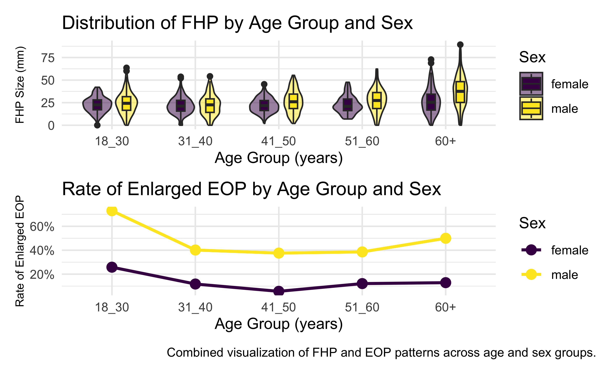
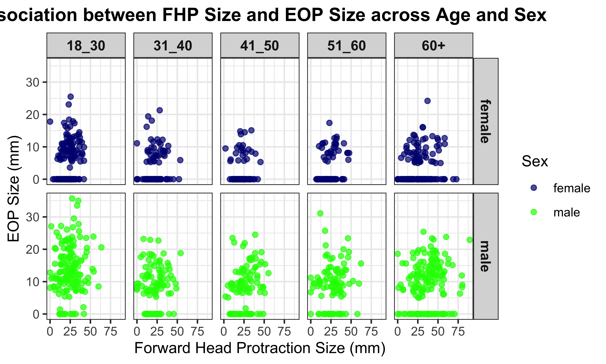

P8105_mtp_bz2561
================
Bohan Zhu
2025-10-18

``` r
library(tidyverse)
```

    ## ── Attaching core tidyverse packages ──────────────────────── tidyverse 2.0.0 ──
    ## ✔ dplyr     1.1.4     ✔ readr     2.1.5
    ## ✔ forcats   1.0.0     ✔ stringr   1.5.1
    ## ✔ ggplot2   3.5.2     ✔ tibble    3.3.0
    ## ✔ lubridate 1.9.4     ✔ tidyr     1.3.1
    ## ✔ purrr     1.1.0     
    ## ── Conflicts ────────────────────────────────────────── tidyverse_conflicts() ──
    ## ✖ dplyr::filter() masks stats::filter()
    ## ✖ dplyr::lag()    masks stats::lag()
    ## ℹ Use the conflicted package (<http://conflicted.r-lib.org/>) to force all conflicts to become errors

``` r
library(readxl)
library(patchwork)
```

# Import and Tidy Data

**I assume cleaning rule for FHP size is same as EOP size**

``` r
exostosis_df = 
  read_excel("data/p8105_mtp_data.xlsx", skip = 8, na = c("NA", ".", "")) |> 
  janitor::clean_names() 
  
exostosis_clean = 
  exostosis_df |> 
  mutate(
    sex= case_match(
      sex, 
      0 ~ "female",
      1 ~ "male"
    ),
    age_group = case_match(
      age_group,
      "2" ~ "18_30",
      "3" ~ "31_40",
      "4" ~ "41_50",
      "5" ~ "51_60",
      c("6", "7", "8") ~ "60+"
    ) |> 
      factor(levels = c("18_30", "31_40", "41_50", "51_60", "60+"),
           ordered = TRUE),
    eop_size_mm = if_else(is.na(eop_size_mm), 0, eop_size_mm),
    eop_size = case_match(
    eop_size,
    "0" ~ "0_5",
    "1" ~ "5_10",
    "2" ~ "10_15",
    "3" ~ "15_20",
    "4" ~ "20_25",
    "5" ~ "25+"
    ) |> 
      factor(levels = c("0_5", "5_10", "10_15", "15_20", "20_25","25+"),
           ordered = TRUE),
    eop_visibility_classification = case_match(
      eop_visibility_classification,
      0 ~ "eop size 0",
      1 ~ "0 < eop size  <=5",
      2 ~ "eop size >= 5"
    ) |> 
      factor(levels = c("eop size 0", "0 < eop size  <=5", "eop size >= 5"),
           ordered = TRUE),
    fhp_size_mm = if_else(is.na(fhp_size_mm), 0, fhp_size_mm),
    fhp_category = case_match(
      fhp_category,
      "0" ~ "0_10",
      "1" ~ "10_20",
      "2" ~ "20_30",
      "3" ~ "30_40",
      "4" ~ "40_50",
      "5" ~ "50_60",
      "6" ~ "60_70",
      "7" ~ "70+"
    ) |> 
      factor(levels = c("0_10", "10_20", "20_30", "30_40", "40_50",
                        "50_60","60_70","70+"),
           ordered = TRUE)
  )
```

The dataset was cleaned by skipping unused header rows, standardizing
variable names, and recoding numeric codes into clear labels. `Sex` was
relabeled as male/female, and `age groups` as 18–30, 31–40, etc.

Missing `EOP` size and `FHP` size measurements were replaced with zeros,
and both `EOP size` and `FHP_category` classifications were converted
into readable, ordered factor levels. The variable
`eop_visibility_classification` was also recoded to reflect visibility
categories.

``` r
exostosis_clean |> 
  summarise(n())
```

    ## # A tibble: 1 × 1
    ##   `n()`
    ##   <int>
    ## 1  1221

``` r
exostosis_clean |>
  group_by(age_group, sex) |>
  summarise(participants = n(), .groups = "drop") |>
  pivot_wider(names_from = sex, values_from = participants) |>
  knitr::kable()
```

| age_group | female | male |
|:----------|-------:|-----:|
| 18_30     |    151 |  152 |
| 31_40     |    102 |  102 |
| 41_50     |    106 |  101 |
| 51_60     |     99 |  101 |
| 60+       |    155 |  150 |
| NA        |      1 |    1 |

After cleaning, the resulting dataset contained 1221 observations and 9
variables. Among the variables, several are key to the analysis.

`EOP size` and `eop_visibility_classification` capture the prominence of
the external protuberance. `FHP size` and `FHP category` are also
important, as they measure forward head posture potentially linked to
EOP growth. Finally, `sex` and `age group` offer demographic context for
biological or behavioral differences.

``` r
exostosis_clean |> 
  filter(is.na(age_group))
```

    ## # A tibble: 2 × 9
    ##   sex      age age_group eop_size_mm eop_size eop_visibility_classif…¹ eop_shape
    ##   <chr>  <dbl> <ord>           <dbl> <ord>    <ord>                        <dbl>
    ## 1 female    17 <NA>              6.4 5_10     eop size >= 5                    1
    ## 2 male      45 <NA>              0   0_5      eop size 0                      NA
    ## # ℹ abbreviated name: ¹​eop_visibility_classification
    ## # ℹ 2 more variables: fhp_size_mm <dbl>, fhp_category <ord>

``` r
exostosis_df |>
  filter(
    (eop_size_mm >= 0 & eop_size_mm < 5 & eop_size != 0) |
    (eop_size_mm >= 5 & eop_size_mm < 10 & eop_size != 1) |
    (eop_size_mm >= 10 & eop_size_mm < 15 & eop_size != 2) |
    (eop_size_mm >= 15 & eop_size_mm < 20 & eop_size != 3) |
    (eop_size_mm >= 20 & eop_size_mm < 25 & eop_size != 4) |
    (eop_size_mm >= 25 & eop_size != 5)
  ) |>
  select(eop_size_mm, eop_size)|> 
  knitr::kable()
```

| eop_size_mm | eop_size |
|------------:|:---------|
|       33.50 | 4        |
|       25.50 | 4        |
|       35.00 | 4        |
|       29.50 | 4        |
|        2.11 | 4        |
|       20.00 | 3        |
|       31.10 | 4        |
|       35.70 | 4        |
|       20.00 | 3        |
|       25.40 | 4        |
|       26.80 | 4        |
|       23.50 | 5        |
|       22.90 | 5        |
|       14.60 | 3        |
|       12.10 | 3        |
|        5.00 | 0        |
|       15.00 | 14.6     |

``` r
exostosis_clean |> 
  group_by(eop_shape) |> 
  summarise(participants = n()) |> 
  knitr::kable()
```

| eop_shape | participants |
|----------:|-------------:|
|         1 |          385 |
|         2 |           95 |
|         3 |          218 |
|         5 |            1 |
|        NA |          522 |

``` r
exostosis_clean |> 
  filter(is.na(fhp_size_mm))
```

    ## # A tibble: 0 × 9
    ## # ℹ 9 variables: sex <chr>, age <dbl>, age_group <ord>, eop_size_mm <dbl>,
    ## #   eop_size <ord>, eop_visibility_classification <ord>, eop_shape <dbl>,
    ## #   fhp_size_mm <dbl>, fhp_category <ord>

``` r
exostosis_clean |>
  filter(
    (fhp_size_mm >= 0  & fhp_size_mm < 10 & fhp_category != "0_10") |
    (fhp_size_mm >= 10 & fhp_size_mm < 20 & fhp_category != "10_20") |
    (fhp_size_mm >= 20 & fhp_size_mm < 30 & fhp_category != "20_30") |
    (fhp_size_mm >= 30 & fhp_size_mm < 40 & fhp_category != "30_40") |
    (fhp_size_mm >= 40 & fhp_size_mm < 50 & fhp_category != "40_50") |
    (fhp_size_mm >= 50 & fhp_size_mm < 60 & fhp_category != "50_60") |
    (fhp_size_mm >= 60 & fhp_category != "60_70" & fhp_category != "70+")
  ) |>
  select(fhp_size_mm, fhp_category) |> 
  knitr::kable()
```

| fhp_size_mm | fhp_category |
|------------:|:-------------|
|        54.1 | 40_50        |
|        63.6 | 40_50        |
|        54.9 | 40_50        |
|        80.2 | 40_50        |
|        54.9 | 40_50        |
|        52.7 | 40_50        |
|        52.1 | 40_50        |
|        54.7 | 40_50        |
|        89.3 | 40_50        |
|        52.7 | 40_50        |
|        51.4 | 40_50        |
|        54.2 | 40_50        |
|        53.6 | 40_50        |
|        51.2 | 40_50        |
|        57.9 | 40_50        |
|        21.1 | 10_20        |
|        33.8 | 10_20        |
|        56.6 | 40_50        |
|        22.9 | 10_20        |
|        31.8 | 20_30        |
|        60.1 | 40_50        |
|        30.1 | 10_20        |
|        31.5 | 20_30        |
|        27.0 | 10_20        |
|        25.0 | 10_20        |
|        53.2 | 40_50        |

``` r
exostosis_df |>
  mutate(fhp_category = as.numeric(fhp_category)) |>
  filter(fhp_category > 7) |> 
  select(fhp_category)
```

    ## # A tibble: 1 × 1
    ##   fhp_category
    ##          <dbl>
    ## 1         30.8

Some categorical variables do not align with their continuous values.
For example, `age_group` has two missing cases—one aged 0–17 (outside
defined groups) and another aged 45 misclassified into group 1.

Some `eop_size_mm` and `fhp_size_mm` values are misclassified, some may
due to inconsistent boundary rules (unmatchable data listed in table
above).

Besides, `eop_shape` includes categories 1, 2, 3, and 5 but lacks 4,
with 500+ NAs suggesting incomplete coding.

One `fhp_category` record (30.8) should fall in the 30–40 range but was
uncategorized.

# Visualization

``` r
Figure_3_advanced = 
  exostosis_clean |>
  filter(!is.na(age_group), !is.na(fhp_size_mm)) |>
  ggplot(aes(x = age_group, y = fhp_size_mm, fill = sex)) +
  geom_violin(width = 0.7, alpha = 0.5) +
  geom_boxplot(width = 0.2, position = position_dodge(width = 0.7)) +
  labs(
    title = "Distribution of FHP by Age Group and Sex",
    x = "Age Group (years)",
    y = "FHP Size (mm)",
    fill = "Sex"
  ) +
  theme(legend.position = "right",
        axis.title.y = element_text(size = 8),
    plot.caption = element_text(size = 5, hjust = 0.5)
  )
```

``` r
Figure_4_advanced =
  exostosis_clean |>
  mutate(
    enlarged = 
      if_else(eop_size %in% c("10_15", "15_20", "20_25", "25+"), 1, 0)
  ) |>
  filter(!is.na(age_group), !is.na(sex)) |>    
  group_by(age_group, sex) |>
  summarise(
    total = n(),
    enlarged_n = sum(enlarged, na.rm = TRUE),
    rate = enlarged_n / total * 100
  ) |>
  ggplot(aes(x = age_group, y = rate, color = sex, group = sex)) +
  geom_line(linewidth = 1) +
  geom_point(size = 3) +
  scale_y_continuous(labels = scales::percent_format(scale = 1)) +
  labs(
    title = "Rate of Enlarged EOP by Age Group and Sex",
    x = "Age Group (years)",
    y = "Rate of Enlarged EOP",
    color = "Sex"
  ) +
  theme(legend.position = "right",
        axis.title.y = element_text(size = 8),
    plot.caption = element_text(size = 5, hjust = 0.5)
)
```

    ## `summarise()` has grouped output by 'age_group'. You can override using the
    ## `.groups` argument.

``` r
combined_plot = 
  (Figure_3_advanced / Figure_4_advanced) +
   plot_annotation(
    caption = "Combined visualization of FHP and EOP patterns across age and sex groups."
  )
combined_plot
```



Males show greater forward head protraction and higher enlarged EOP
prevalence, consistent with the pattern described by the authors. both
FHP and EOP measures show a mid-age decline followed by an increase in
older groups.

``` r
exostosis_clean |>
  filter(!is.na(age_group)) |>
  ggplot(aes(x = fhp_size_mm, y = eop_size_mm, color = sex)) +
  geom_point(alpha = 0.7, size = 1.5) +
  facet_grid(sex ~ age_group) +
  scale_color_manual(values = c("female" = "navy", "male" = "green")) +
  labs(
    title = "Association between FHP Size and EOP Size across Age and Sex",
    x = "Forward Head Protraction Size (mm)",
    y = "EOP Size (mm)",
    color = "Sex"
  ) +
  theme_bw(base_size = 11) +
  theme(
    strip.text = element_text(size = 10, face = "bold"),
    plot.title = element_text(hjust = 0.5, face = "bold")
  )
```



The plot shows a weak FHP–EOP relationship across age and sex. Data are
scattered with no clear trend. Males show greater variability and larger
EOP sizes, suggesting sex seems to have a stronger influence than FHP.

# Reproducing reported results and discussion

``` r
exostosis_clean |>
  drop_na(age_group) |>
  group_by(age_group) |>
  summarise(participants = n()) |>
  knitr::kable()
```

| age_group | participants |
|:----------|-------------:|
| 18_30     |          303 |
| 31_40     |          204 |
| 41_50     |          207 |
| 51_60     |          200 |
| 60+       |          305 |

Small discrepancies exist between the authors’ stated and observed
sample sizes, with 21 more participants overall and differences in all
age groups except 51–60.

``` r
exostosis_clean |>
  group_by(sex) |>
  summarise(
    mean_FHP = round(mean(fhp_size_mm), 2),
    sd_FHP = round(sd(fhp_size_mm), 2),
  ) |> 
  knitr::kable()
```

| sex    | mean_FHP | sd_FHP |
|:-------|---------:|-------:|
| female |    23.65 |  10.69 |
| male   |    28.32 |  14.80 |

The authors reported mean FHP of $28 \pm 15$ mm in males and $24 \pm 11$
mm in females. Our sample shows $23.65 \pm 10.69$ mm for males and
$28.32 \pm 14.80$ mm for females, largely consistent with the authors’
findings.

``` r
exostosis_clean |>
  summarise(
    EEOP_prevalence = (sum(eop_size_mm > 10, na.rm = TRUE) /
                       sum(!is.na(eop_size_mm))) * 100
  )
```

    ## # A tibble: 1 × 1
    ##   EEOP_prevalence
    ##             <dbl>
    ## 1            32.1

EEOP defined as an EOP exceeding 10 mm in size. Results based on sample
equals $32.1 \% \approx 33\%$ (According to the author).

``` r
exostosis_clean |>
  drop_na(age_group) |>
  group_by(age_group) |>
  summarise(
    FHP_over_40_percent = (sum(fhp_size_mm > 40) / n()) * 100
  )
```

    ## # A tibble: 5 × 2
    ##   age_group FHP_over_40_percent
    ##   <ord>                   <dbl>
    ## 1 18_30                    6.60
    ## 2 31_40                    5.88
    ## 3 41_50                    8.70
    ## 4 51_60                   11   
    ## 5 60+                     32.5

Among participants over 60, $32.5%$ (close to $34.5%$) had FHP \> 40 mm
— the highest rate across groups, consistent with both the trend and
values reported by the authors.

**Conclusion**

Results largely match the report, though coding and visualization issues
reduce clarity. The data show associations, not causation; verifying the
phone-use hypothesis needs detailed posture, usage, and longitudinal
evidence.
